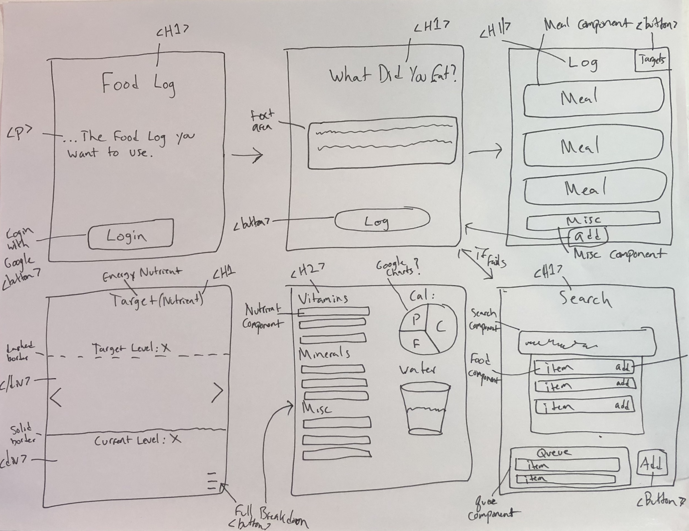

# Food Log/Diary

## Description

  The Food log you actually want to use. It has been shown that what you eat holds a large window into your future health. That's why the easier it is to track your food, the more likely you are to actually do so, which provides better insight into your health. This app makes it as simple as possible to do so. Simply type in what you ate, in a natural way..i.e "for lunch I had a sweet potato with half an avocado and a cup of black beans.", and the app will log your food for you, complete with all the metrics your nutritionist will fancy. You can see a detailed overview of all the nutrients of the food you consume. Or It could be simple and you can just see how many calories your eating compared to how much your burning. Either way, this app aims to effortlessly log your food as quick and simple as possible so you can get on with your day.

## Specifications

  * Upon page load, User will see a landing page with the name of the website, a brief description, and an option to login with Google.

  * When User is logged In, User will see their log for the Day, with options to go back and forth between days at the sides.

  * Depending on the Time of day, User will see a "Hey User What's for Breakfast?" or  "Hey User What's for Dinner?

  * If User already has food in log, log is displayed instead.

  * User will see a menu on the bottom to choose to switch between log and Nutrient breakdown

  * If User clicks on Nutrient Targets button, Nutrient Target Page is shown.

  * If User clicks on Meal, Nutrient breakdown is shown just for that meal.

  * On Nutrient Target page, User is shown a meter filling up the entire screen and a button on the top right to expand to full Nutrient breakdown.

## MVP

  User is able to login.
  User can add a food or meal to log.
  User can see breakdown of meal.

## Wireframes

  
